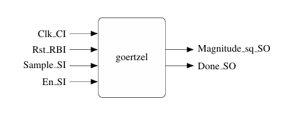

# Goertzel Filter Project - README

## Project Overview

Teamwork for FH Dortmund

This project involves the design and verification of a Goertzel Filter. The filter is designed to detect specific signal frequencies and is implemented using synthesizable VHDL code. The project includes literature research, design, and verification stages.

## Team Members

- Rahim Hashimov
- Ilker Kurtulan
- Igor Risteski
- Nhat Lam Nguyen


## Objectives

1. **Goertzel Algorithm Description**

     - **Intermediate Sum Calculation in Goertzel Algorithm**:
        <br>This process is part of the Goertzel algorithm that calculates the intermediate sum `Sum`. It converts the 12-bit unsigned input `Sample_SI` to a 20-bit signed value for internal processing. The sum is computed by combining the converted input, a scaled previous   state `s1_D`, and an adjusted previous state `s2_D`. The result is then truncated to fit the 20-bit internal width and assigned to the state variable `s0`. The state variables s1_D and `s2_D` are updated for the next iteration, where `s1_D` takes the value of `s0` and `s2_D` takes the value of `s1_D`.
        <br>
        - **Sum**: Intermediate sum combining the input sample and scaled previous states.
        - **s0**: Current state variable holding the processed sum.
        - **s1_D**: Previous state variable updated to the current state s0.
        - **s2_D**: Two-step previous state variable updated to the previous state s1_D.
        - **C**: Constant used for scaling in the Goertzel algorithm.
        - **LSB_TRUNC**: Truncation constant for least significant bits.
        - **MAG_TRUNC**: Truncation constant for magnitude.

        ```vhdl
        Sum <= resize(SIGNED('0' & Sample_SI), INT_BW + LSB_TRUNC) +
        resize(SHIFT_RIGHT(C * s1_D, C_F - LSB_TRUNC), INT_BW + LSB_TRUNC) -
        SHIFT_LEFT(resize(s2_D, INT_BW + LSB_TRUNC), LSB_TRUNC);
        s0 <= Sum(INT_BW + LSB_TRUNC - 1 DOWNTO LSB_TRUNC); 
        s1_D <= s0;
        s2_D <= s1_D;
     - **Magnitude Calculation in Goertzel Algorithm**:
        <br>This section calculates the squared magnitude of the detected frequency. Intermediate products (`temp_product1`, `temp_product2`, and `temp_product3`) are computed and summed to get the intermediate sum `temp_sum`. The result is clamped to ensure it is non-negative and fits within the specified bit width, then assigned to the output signal `Magnitude_sq_SO`.
        ```vhdl
                temp_sum <= temp_product1 + temp_product2 - temp_product3;

                -- Ensure non-negative magnitude
                IF temp_sum < 0 THEN
                    magnitude_internal <= (OTHERS => '0');
                ELSE
                    magnitude_internal <= temp_sum;
                END IF;

                -- Improved clamping to handle intermediate range values
                magnitude_clamped <= resize(magnitude_internal(2 * INT_BW - 1 DOWNTO MAG_TRUNC), INT_BW);

                -- Ensure magnitude_clamped is non-negative
                IF magnitude_clamped < 0 THEN
                    magnitude_clamped <= (OTHERS => '0');
                END IF;  
                -- Assign the clamped magnitude to the output port
                Magnitude_sq_SO <= magnitude_clamped;

2. **Literature Research**
   - Perform research on the state of the art (SoA) for Goertzel ASIC and FPGA implementations using sources like IEEExplore.

3. **Design Specifications**
     - **Clk_CI**: Clock input signal that synchronizes the processing.
     - **Rst_RBI**: Active-low reset signal to initialize the filter.
     - **Sample_SI**: 12-bit unsigned input signal representing the sampled data.
     - **Magnitude_sq_SO**: Output signal providing the squared magnitude of the detected frequency.
     - **En_SI**: Enable signal to start the filter processing.
     - **Done_SO**: Output signal indicating the completion of processing.

     


4. **Verification**
     - ### Explanation

        <br>The provided VHDL code reads expected values from a file and compares them with the actual output of the Goertzel filter. The process is as follows:

        - #### Reading Expected Value :<br>
          - The loop iterates through each line of the expected value file.
          - It reads each line into `expected_line` and extracts `expected_data`.
          - It compares the beginning part of `expected_data` with `waveform_name`.
          - If they match, it reads the `expected_value` and exits the loop.
          ```vhdl
            -- Read expected value
            while not endfile(expected_file) loop
               readline(expected_file, expected_line);
               read(expected_line, expected_data);
               if trim(expected_data(1 to waveform_name'length)) = trim(waveform_name) then
                   read(expected_line, expected_value);
                   exit;
               end if;
            end loop;

        - #### Comparison with Expected Result:<br>
          - The `expected_value` is converted to a signed value with the same length as `Magnitude_sq_SO`.
          - It checks if the resized expected value matches `Magnitude_sq_SO`.
          - If they do not match, it reports a failure message indicating the expected and actual values, with a severity level of "warning".
           ```vhdl
            -- Compare with expected result
            var_expected := to_signed(expected_value, Magnitude_sq_SO'length);
            assert resize(var_expected, Magnitude_sq_SO'length) = Magnitude_sq_SO
            report "FAIL, Expected Magnitude_sq_SO: " & integer'image(to_integer(var_expected)) &
                   " Actual: " & integer'image(to_integer(Magnitude_sq_SO))
            severity warning;

5. **Files and Directories**

- **GoertzelFilterCodeAssignment**: Contains the  VHDL files and Matlab files (for the waves and generation 
                                    and expectected output values) for the Goertzel Filter.

- **Documentation**: Research papers and documentation on the Goertzel Algorithm and its implementations.

6. **Usage**

      **Setting Up**
      - Ensure all VHDL files are compiled using a suitable VHDL compiler.
      - We have used Vivado Design Suite compliler. However, you may choose another compliler as well.
      - Place place all the files within the same directory to ensure smooth operation.

      **Running the Testbench**
      - Execute the VHDL testbench to verify the filter's performance against the provided test cases.
      - Use simulation to view the generate plots for the clock, the input sample, output values for Goertzel filter, and etc.

      **Analysis**
      - Analyze the output to ensure the filter detects the specified frequencies correctly.

7. ***Contributions***

    - Rahim Hashimov  `25%`
    - Ilker Kurtulan  `25%`
    - Igor Risteski   `25%`
    - Nhat Lam Nguyen `25%`

